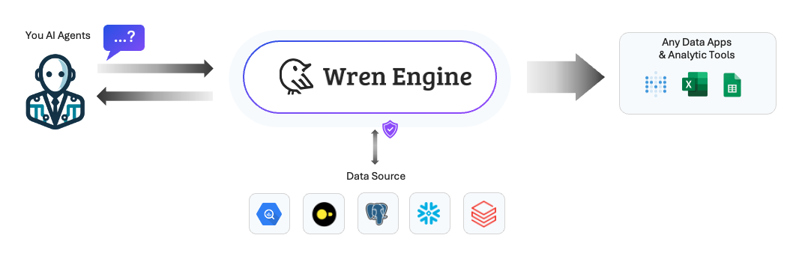
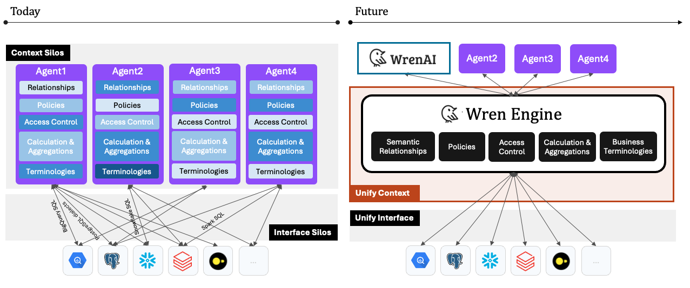

<p align="center">
  <a href="https://getwren.ai">
    <picture>
      <source media="(prefers-color-scheme: light)" srcset="./misc/wrenai_logo.png">
      
    </picture>
    <h1 align="center">Wren Engine</h1>
  </a>
</p>

<p align="center">
  <a aria-label="Follow us" href="https://x.com/getwrenai">
    
  </a>
  <a aria-label="License" href="https://github.com/Canner/wren-engine/blob/main/LICENSE">
    
  </a>
  <a aria-label="Join the community on GitHub" href="https://discord.gg/5DvshJqG8Z">
    
  </a>
  <a aria-label="Canner" href="https://cannerdata.com/">
    
  </a>
</p>

> Wren Engine is the semantic engine for LLMs, the backbone of the [Wren AI](https://github.com/Canner/WrenAI) project.



Useful links
- [Wren AI Website](https://getwren.ai)
- [Wren Engine Documentation](https://docs.getwren.ai/engine/get_started/what_is)

## 🎯 Our Mission

The Wren engine aims to be compatible with composable data systems. It follows two important traits: Embeddable and interoperability. With these two designs in mind, you can reuse the semantic context across your AI agents through our APIs and connect freely with your on-premise and cloud data sources, which nicely fit into your existing data stack.



🤩 [About our Vision - The new wave of Composable Data Systems and the Interface to LLM agents](https://blog.getwren.ai/the-new-wave-of-composable-data-systems-and-the-interface-to-llm-agents-ec8f0a2e7141)

## 🤔 Concepts

- [Introducing Wren Engine](https://docs.getwren.ai/engine/get_started/what_is)
- [What is semantics?](https://docs.getwren.ai/engine/concept/what_is_semantics)
- [What is Modeling Definition Language (MDL)?](https://docs.getwren.ai/engine/concept/what_is_mdl)
- [Benefits of Wren Engine with LLMs](https://docs.getwren.ai/engine/concept/benefits_llm)

## 🚧 Project Status
Wren Engine is currently in the alpha version. The project team is actively working on progress and aiming to release new versions at least biweekly.

## ⭐️ Community

- Welcome to our [Discord server](https://discord.gg/5DvshJqG8Z) to give us feedback!
- If there is any issues, please visit [Github Issues](https://github.com/Canner/wren-engine/issues).

## 🚀 Get Started

Check out our latest documentation to get a [Quick start](https://docs.getwren.ai/engine/get_started/quickstart).

## 🙌 How to build?

### Normal Build

```bash
mvn clean install -DskipTests
```

### Build an executable jar

```bash
mvn clean package -DskipTests -P exec-jar
```
