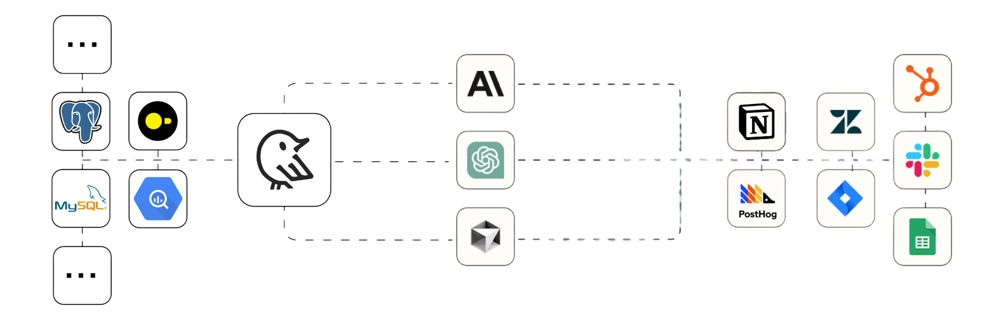

  <a href="https://getwren.ai">
    <picture>
      <source media="(prefers-color-scheme: light)" srcset="./misc/wrenai_logo.png">
      
    </picture>
    <h1 align="center">Wren Engine</h1>
  </a>

  
  
  
  

> Wren Engine is the Semantic Engine for MCP Clients and AI Agents. 
> [Wren AI](https://github.com/Canner/WrenAI) GenBI AI Agent is based on Wren Engine.

## 🔌 Supported Data Sources
- [BigQuery](https://docs.getwren.ai/oss/wren_engine_api#tag/BigQueryProjectConnectionInfo)
- [Google Cloud Storage](https://docs.getwren.ai/oss/wren_engine_api#tag/GcsFileConnectionInfo)
- [Local Files](https://docs.getwren.ai/oss/wren_engine_api#tag/LocalFileConnectionInfo)
- [MS SQL Server](https://docs.getwren.ai/oss/wren_engine_api#tag/MSSqlConnectionInfo)
- [Minio](https://docs.getwren.ai/oss/wren_engine_api#tag/MinioFileConnectionInfo)
- [MySQL Server](https://docs.getwren.ai/oss/wren_engine_api#tag/MySqlConnectionInfo)
- [Oracle Server](https://docs.getwren.ai/oss/wren_engine_api#tag/OracleConnectionInfo)
- [PostgreSQL Server](https://docs.getwren.ai/oss/wren_engine_api#tag/PostgresConnectionInfo)
- [Amazon S3](https://docs.getwren.ai/oss/wren_engine_api#tag/S3FileConnectionInfo)
- [Snowflake](https://docs.getwren.ai/oss/wren_engine_api#tag/SnowflakeConnectionInfo)
- [Trino](https://docs.getwren.ai/oss/wren_engine_api#tag/TrinoConnectionInfo)
- [Athena](https://docs.getwren.ai/oss/wren_engine_api#tag/AthenaConnectionInfo)
- [Databricks](https://docs.getwren.ai/oss/wren_engine_api#tag/DatabricksTokenConnectionInfo)
- [Redshift](https://docs.getwren.ai/oss/wren_engine_api#tag/RedshiftConnectionInfo)
- [Apache Spark](https://docs.getwren.ai/oss/wren_engine_api#tag/SparkConnectionInfo)

## 😫 Challenge Today

At the enterprise level, the stakes - and the complexity - are much higher. Businesses run on structured data stored in cloud warehouses, relational databases, and secure filesystems. From BI dashboards to CRM updates and compliance workflows, AI must not only execute commands but also **understand and retrieve the right data, with precision and in context**.

While many community and official MCP servers already support connections to major databases like PostgreSQL, MySQL, SQL Server, and more, there's a problem: **raw access to data isn't enough**.

Enterprises need:
- Accurate semantic understanding of their data models
- Trusted calculations and aggregations in reporting
- Clarity on business terms, like "active customer," "net revenue," or "churn rate"
- User-based permissions and access control

  

Natural language alone isn't enough to drive complex workflows across enterprise data systems. You need a layer that interprets intent, maps it to the correct data, applies calculations accurately, and ensures security.

## 🎯 Our Mission

Wren Engine is on a mission to power the future of MCP clients and AI agents through the Model Context Protocol (MCP) — a new open standard that connects LLMs with tools, databases, and enterprise systems.

As part of the MCP ecosystem, Wren Engine provides a **semantic engine** powered the next generation semantic layer that enables AI agents to access business data with accuracy, context, and governance. 

By building the semantic layer directly into MCP clients, such as Claude, Cline, Cursor, etc. Wren Engine empowers AI Agents with precise business context and ensures accurate data interactions across diverse enterprise environments.

We believe the future of enterprise AI lies in **context-aware, composable systems**. That’s why Wren Engine is designed to be:

- 🔌 **Embeddable** into any MCP client or AI agentic workflow
- 🔄 **Interoperable** with modern data stacks (PostgreSQL, MySQL, Snowflake, etc.)
- 🧠 **Semantic-first**, enabling AI to “understand” your data model and business logic
- 🔐 **Governance-ready**, respecting roles, access controls, and definitions

  

With Wren Engine, you can scale AI adoption across teams — not just with better automation, but with better understanding.

***Check our full article***

🤩 [Our Mission - Fueling the Next Wave of AI Agents: Building the Foundation for Future MCP Clients and Enterprise Data Access](https://getwren.ai/post/fueling-the-next-wave-of-ai-agents-building-the-foundation-for-future-mcp-clients-and-enterprise-data-access)

## 🚀 Get Started with MCP 
[MCP Server README](mcp-server/README.md)

https://github.com/user-attachments/assets/dab9b50f-70d7-4eb3-8fc8-2ab55dc7d2ec

👉 Blog Post Tutorial: [Powering AI-driven workflows with Wren Engine and Zapier via the Model Context Protocol (MCP)](https://getwren.ai/post/powering-ai-driven-workflows-with-wren-engine-and-zapier-via-the-model-context-protocol-mcp?utm_campaign=10904457-MCP&utm_content=330804773&utm_medium=social&utm_source=linkedin&hss_channel=lcp-89794921)

## 🤔 Concepts

- [Powering Semantic SQL for AI Agents with Apache DataFusion](https://getwren.ai/post/powering-semantic-sql-for-ai-agents-with-apache-datafusion)
- [Quick start with Wren Engine](https://docs.getwren.ai/oss/engine/get_started/quickstart)
- [What is semantics?](https://docs.getwren.ai/oss/engine/concept/what_is_semantics)
- [What is Modeling Definition Language (MDL)?](https://docs.getwren.ai/oss/engine/concept/what_is_mdl)
- [Benefits of Wren Engine with LLMs](https://docs.getwren.ai/oss/engine/concept/benefits_llm)

## 🚧 Project Status
Wren Engine is currently in the beta version. The project team is actively working on progress and aiming to release new versions at least biweekly.

## 🛠️ Developer Guides
The project consists of 4 main modules:
1. [ibis-server](./ibis-server/): the Web server of Wren Engine powered by FastAPI and Ibis
2. [wren-core](./wren-core): the semantic core written in Rust powered by [Apache DataFusion](https://github.com/apache/datafusion)
3. [wren-core-py](./wren-core-py): the Python binding for wren-core
4. [mcp-server](./mcp-server/): the MCP server of Wren Engine powered by [MCP Python SDK](https://github.com/modelcontextprotocol/python-sdk)

## ⭐️ Community

- Welcome to our [Discord server](https://discord.gg/5DvshJqG8Z) to give us feedback!
- If there is any issues, please visit [Github Issues](https://github.com/Canner/wren-engine/issues).

